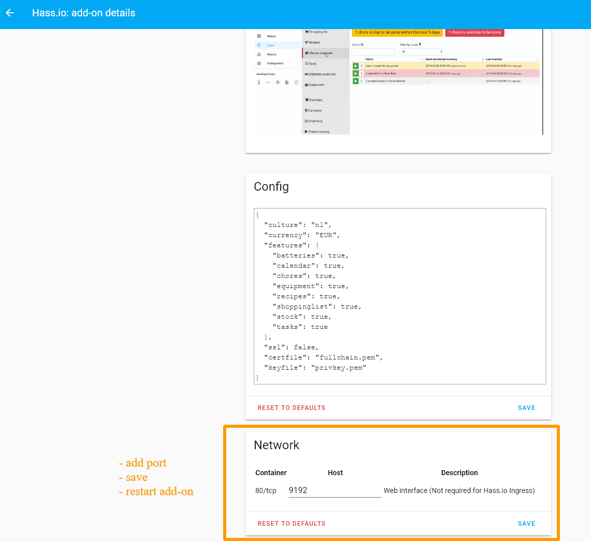

[](https://github.com/hacs/integration)

---
**INFO**

**The integration supports Grocy version 3.2 and above.**

**At least Home Assistant version 2021.12 is required for the integration from v4.3.3 and above.**

You have to have the Grocy software already installed and running, this integration only communicates with an existing installation of Grocy. You can install the software with the [Grocy add-on](https://github.com/hassio-addons/addon-grocy) or another installation method, found at [Grocy website](https://grocy.info/).

---

# Adding the integration

## First steps <a name="addon"></a>for Grocy add-on
The configuration is slightly different for those who use the [official Grocy add-on](https://github.com/hassio-addons/addon-grocy) from the add-on store.

1. If you haven't already done so, install Grocy from the add-on store.
2. In the 'Configuration' section of the add-on config, input `9192` in the Network port field - see [screenshot](#screenshot-addon-config). Save your changes and restart the add-on.
3. Now continue with the instructions below.

## Instructions for <a name="both"></a>both installation methods
1. Install [HACS](https://hacs.xyz/), if you haven't already done so.
2. In Home Assistant go to HACS > Integrations. Search for the "Grocy custom component" repository by clicking the "Explore & download repositories" button in the bottom right corner.
3. In the bottom right corner click "Download the repository with HACS". Click "Download". Optional: for latest features and fixes choose "Show beta versions".
4. Restart Home Assistant as instructed by HACS.
5. Install the [Grocy integration](https://my.home-assistant.io/redirect/config_flow_start/?domain=grocy). Fill out the information according to [this instruction](#integration-configuration).
6. Before integration version v4.3.3, now restart Home Assistant again (with later versions you can skip this step).
7. You will now have a new integration for Grocy. All entities are disabled from start, manually enable the entities you want to use. It can take up to 30 seconds before all entities are visible.

Future integration updates will appear automatically within Home Assistant via HACS.


# Entities

**All entities are disabled from the start. You have to manually enable the entities you want to use in Home Assistant.**
You get a sensor each for chores, meal plan, shopping list, stock, tasks and batteries. The sensors refresh every 60 seconds.
You get a binary sensor each for overdue, expired, expiring and missing products and for overdue tasks, overdue chores and overdue batteries. The binary sensors refresh every 5 minutes.


# Services

The following services come with the integration. For all available options check the [Developer Tools: Services](https://my.home-assistant.io/redirect/developer_services/) within Home Assistant.

- **Grocy: Add Generic** (_grocy.add_generic_)

Adds a single object of the given entity type.

- **Grocy: Add Product To Stock** (_grocy.add_product_to_stock_)

Adds a given amount of a product to the stock.

- **Grocy: Open Product** (_grocy.open_product_)

Opens a given amount of a product in stock.

- **Grocy: Track Battery** (_grocy.track_battery_)

Tracks the given battery.

- **Grocy: Complete Task** (_grocy.complete_task_)

Completes the given task.

- **Grocy: Consume Product From Stock** (_grocy.consume_product_from_stock_)

Consumes a given amount of a product from the stock.

- **Grocy: Execute Chore** (_grocy.execute_chore_)

Executes the given chore with an optional timestamp and executor.

- **Grocy: Consume Recipe** (_grocy.consume_recipe_)

Consumes the given recipe.


# Translations

Translations are done via [Lokalise](https://app.lokalise.com/public/260939135f7593a05f2b79.75475372/). If you want to translate into your native language, please [join the team](https://app.lokalise.com/public/260939135f7593a05f2b79.75475372/).


# Troubleshooting

If you have problems with the integration you can add debug prints to the log.

```yaml
logger:
  default: info
  logs:
    pygrocy.grocy_api_client: debug
    custom_components.grocy: debug
```

If you are having issues and want to report a problem, always start with making sure that you're on the latest _beta_ version of the integration, Grocy and Home Assistant.

You can ask for help [in the forums](https://community.home-assistant.io/t/grocy-custom-component-and-card-s/218978), or [make an issue with all of the relevant information here](https://github.com/custom-components/grocy/issues/new?assignees=&labels=&template=bug_report.md&title=).


# <a name="integration-configuration"></a>Integration configuration

## URL
The Grocy url should be in the form below (start with `http://` or `https://`) and point to your Grocy instance. If you use a SSL certificate you should have `https` and also check the "Verify SSL Certificate" box. Do **not** enter a port in the url field. Subdomains are also supported, fill out the full url in the field.

## API key
Go to your Grocy instance. Navigate via the wrench icon in the top right corner to "Manage API keys" and add a new API key. Copy and paste the generated key.

## Port
It should work with for example a Duck DNS address as well, but you still have to access it via a port, and the above instructions for the url still apply.
- If you have configured the [Grocy add-on](#addon) as described, use port 9192 (without https). Either be sure the port is open in your router or use your internal Home Assistant address.
- If you have configured an [external Grocy](#both) instance and not sure, use port 80 for http or port 443 for https. Unless you have set a custom port for Grocy.


# <a name="screenshot-addon-config"></a>Add-on port configuration


